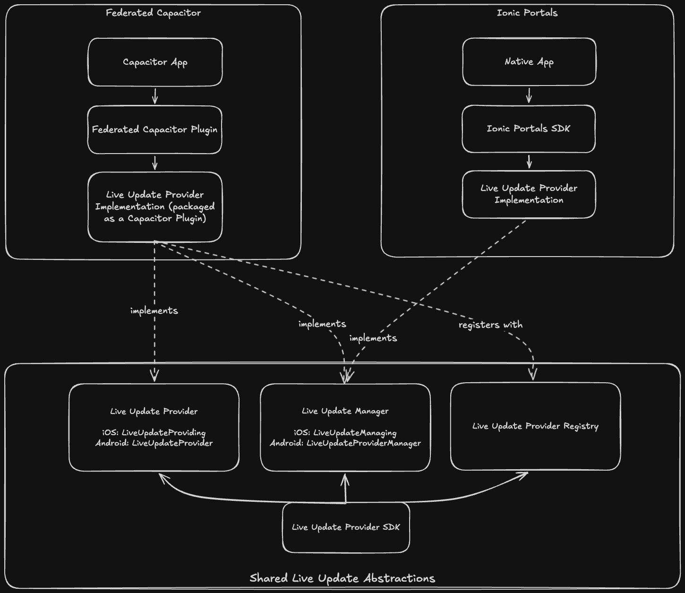
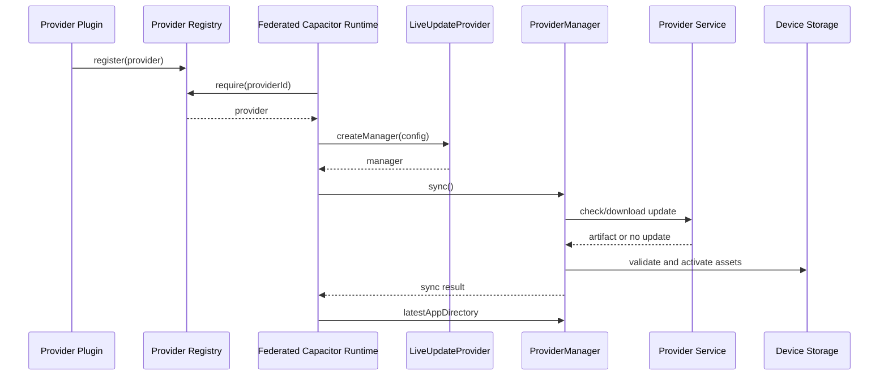
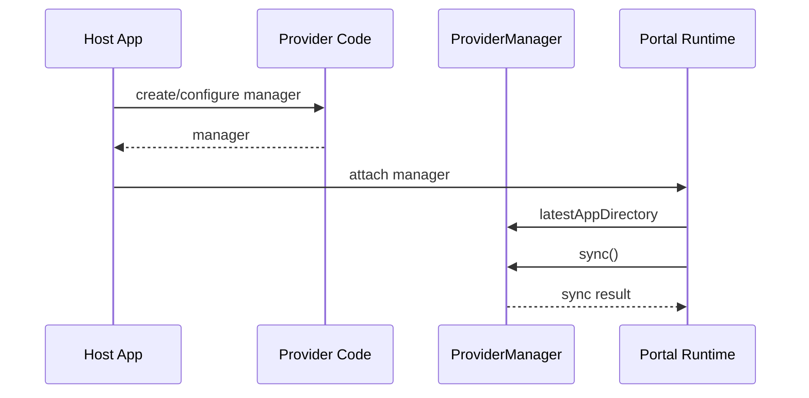

# Architecture

## Purpose

This repository defines the provider-facing SDK contracts that let Ionic Portals and Federated Capacitor integrate with custom live update services. The SDK does not implement an update backend, artifact downloader, or update storage strategy. Instead, it provides stable iOS and Android interfaces that provider implementations can conform to while the host runtime depends on a common contract.

This document is written for:

- Developers implementing a custom live update provider for Portals or Federated Capacitor.
- Maintainers evolving the provider contracts, registry behavior, or platform packages.
- Teams trying to understand the boundary between this SDK, a provider implementation, and a live update backend service.

## Runtime Overview

### Architecture pieces



The diagram shows how Federated Capacitor and Ionic Portals both depend on the shared provider abstractions exposed by this SDK. Federated Capacitor provider implementations are packaged as Capacitor plugins, implement the provider and manager contracts, and register with the provider registry. Portals integrations can implement the manager contract directly and hand that manager to the Portals SDK.

### How provider selection works

Federated Capacitor integrations register provider implementations at app startup. The host runtime resolves a provider by its string identifier, creates a manager with provider-specific configuration, and then calls the manager to sync assets.

Portals integrations can depend directly on a provider-created manager. In that mode, the registry and provider lookup layer are optional because the host app can create the manager itself.

Key files:

- iOS: `ios/Sources/LiveUpdateProvider/Manager.swift`
- iOS: `ios/Sources/LiveUpdateProvider/FederatedCapacitor/Provider.swift`
- iOS: `ios/Sources/LiveUpdateProvider/FederatedCapacitor/Registry.swift`
- Android: `android/live-update-provider/src/main/kotlin/io/ionic/liveupdateprovider/federatedcapacitor/LiveUpdateProvider.kt`
- Android: `android/live-update-provider/src/main/kotlin/io/ionic/liveupdateprovider/ProviderManager.kt`
- Android: `android/live-update-provider/src/main/kotlin/io/ionic/liveupdateprovider/federatedcapacitor/ProviderRegistry.kt`

### Runtime modes

| Mode | Entry point | What it does |
| --- | --- | --- |
| Portals | `ProviderManager` | Gives a configured Portal a manager that can report its latest app directory and perform provider-defined sync work. |
| Federated Capacitor | `LiveUpdateProvider` plus registry lookup | Lets a provider plugin register itself by ID so the Federated Capacitor runtime can create managers from configuration. |

### Runtime capability boundaries

| Layer | What is defined here | What it does not own |
| --- | --- | --- |
| Provider SDK | Interfaces, registry lookup, error types, sync result shape, and optional metadata bridge result. | Network protocol, authentication, artifact download, content verification, file extraction, rollback, cleanup policy, and app reload behavior. |
| Provider implementation | Manager creation, sync behavior, `latestAppDirectory` maintenance, provider-specific metadata, and storage cleanup. | The shared SDK ABI/API contracts. |
| Live update backend | Channel resolution, artifact metadata, update availability, signed URLs, and deployment policy. | Mobile runtime interface definitions. |
| Host runtime | Calls into the provider contract and uses the latest app directory. | Provider-specific service integration details. |

## Contract Architecture

All platforms expose the same conceptual model:

```text
LiveUpdateProvider
`-- createManager(config)
    `-- ProviderManager
        |-- latestAppDirectory
        `-- sync()
            `-- ProviderSyncResult
                `-- MetadataSyncResult (optional metadata bridge)
```

### Contract matrix

| Concept | iOS | Android | Responsibility |
| --- | --- | --- | --- |
| Provider | `LiveUpdateProvider` | `LiveUpdateProvider` | Identifies a provider and creates managers from provider-specific configuration. |
| Manager | `ProviderManager` | `ProviderManager` | Tracks the latest app directory and performs sync. |
| Sync result marker | `ProviderSyncResult` | `ProviderSyncResult` | Allows providers to return implementation-specific sync results. |
| Metadata sync result | `MetadataSyncResult` | `MetadataSyncResult` | Built-in result carrying bridge-safe metadata for host integrations such as Federated Capacitor. |
| Registry | `ProviderRegistry.shared` | `ProviderRegistry` object | Stores providers by ID for runtime lookup. |
| Error type | `ProviderError` enum | `ProviderError` sealed interface | Standardizes provider-not-registered, invalid-configuration, and sync-failed errors. |

### Provider responsibilities

Provider implementations own live update behavior. A provider must:

- Validate provider-specific configuration before returning a manager.
- Return `invalidConfiguration` / `InvalidConfiguration` when required configuration is missing or invalid.
- Keep `latestAppDirectory` pointed at the latest app directory when one exists.
- Update `latestAppDirectory` before reporting sync success when sync prepares a new bundle.
- Leave `latestAppDirectory` unchanged when sync fails or when no new bundle is prepared.
- Never point `latestAppDirectory` at a partially downloaded, partially extracted, or invalid bundle.
- If activation fails, leave `latestAppDirectory` unchanged or restore it to a known-valid app directory.
- Return `syncFailed` / `SyncFailed` when sync cannot complete.

A production provider should also:

- Download, validate, store, and activate new web assets during sync.
- Verify artifacts before activation.
- Preserve enough state to recover from failed activation or rollback.
- Clean up unused disk assets according to the provider's retention policy.
- Return provider-defined sync metadata when useful.

`latestAppDirectory` is optional on both platforms. A successful sync may leave it unset when the provider has no app directory for the host runtime to load.

### Federated Capacitor metadata

`MetadataSyncResult` is an optional metadata bridge. Providers may return any `ProviderSyncResult` from sync. A provider should return `MetadataSyncResult` when a host integration, such as Federated Capacitor, should pass provider metadata from native sync to JavaScript.

Metadata may be visible to application JavaScript. Providers should not include secrets, credentials, signed URLs, or internal-only service details.

Metadata intended for JavaScript exposure should use bridge-safe values: strings, numbers, booleans, nulls, arrays/lists, and plain dictionaries/maps. Providers should not include native-only objects such as URLs, files, exceptions, streams, or platform handles. Provider configuration remains provider-specific and is not constrained to bridge-safe values by this SDK.

### SDK responsibilities

The SDK is intentionally small. It owns:

- Cross-platform naming and shape of the provider contracts.
- Registry behavior for Federated Capacitor provider discovery.
- Common error categories.
- The optional metadata bridge shape used by Federated Capacitor.
- Package definitions for Swift Package Manager, CocoaPods, and Android Maven consumers.

The SDK does not prescribe a backend API contract. Teams building a backend service should use `docs/live-update-service-architecture.md` for service architecture guidance.

## Registry Architecture

The registry exists so provider plugins can register themselves during plugin load and host runtimes can resolve providers later by ID.

### Registry behavior

| Operation | Behavior |
| --- | --- |
| `register(provider)` | Stores a provider under its `id`. Empty IDs and duplicate IDs fail with `invalidConfiguration` / `InvalidConfiguration`. |
| `resolve(id)` | Returns the registered provider or `nil` / `null` when missing. |
| `require(id)` | Returns the registered provider or throws `providerNotRegistered` / `ProviderNotRegistered`. |

### Thread safety

Both platform registries are designed for concurrent access:

- iOS uses an `NSLock` around the provider dictionary.
- Android uses a `ConcurrentHashMap` and `putIfAbsent` for duplicate-safe registration.

Evidence:

- `ios/Sources/LiveUpdateProvider/FederatedCapacitor/Registry.swift`
- `android/live-update-provider/src/main/kotlin/io/ionic/liveupdateprovider/federatedcapacitor/ProviderRegistry.kt`
- `ios/Tests/LiveUpdateProviderTests/ProviderRegistryTests.swift`
- `android/live-update-provider/src/test/kotlin/io/ionic/liveupdateprovider/federatedcapacitor/ProviderRegistryTests.kt`

## Communication Patterns

The SDK passes only a few stable shapes across the provider boundary:

- Provider ID: a string used for registration and runtime lookup.
- Provider config: provider-specific key/value data used to create a manager.
- Latest app directory: a filesystem path pointing to the latest provider-prepared web bundle.
- Sync result: a provider-defined result object, optionally carrying metadata for Federated Capacitor.
- Error: a standard SDK error category with provider-supplied details and optional underlying cause.

### Operation map

| Operation | Host/runtime responsibility | Provider implementation responsibility | Data crossing the boundary |
| --- | --- | --- | --- |
| Register provider | Load provider plugin or application code. | Call registry registration with a stable provider ID. | `provider.id` |
| Resolve provider | Look up provider by configured ID. | Ensure registration has occurred before lookup. | provider ID |
| Create manager | Pass provider-specific configuration to the provider. | Validate config and return a configured manager. | config map / dictionary |
| Read latest directory | Use the manager's latest directory to load web assets. | Keep `latestAppDirectory` pointed at the latest app directory. | file URL / file path |
| Sync | Trigger sync from the host runtime or application. | Fetch, validate, apply, clean up, then report success or failure. | sync result or sync error |
| Bridge metadata | Inspect Federated Capacitor result when present. | Return metadata that is safe to expose to the web layer. | metadata map / dictionary |

### Federated Capacitor sequence



### Portals sequence



## Repository Topology

| Path | Responsibility |
| --- | --- |
| `ios/Sources/LiveUpdateProvider` | Swift provider contracts, registry, errors, and metadata sync result. |
| `ios/Tests/LiveUpdateProviderTests` | Swift tests for registry behavior and concurrency safety. |
| `android/live-update-provider/src/main/kotlin/io/ionic/liveupdateprovider` | Kotlin provider contracts, registry, errors, callback interfaces, metadata sync result, and Kotlin coroutine helpers. |
| `android/live-update-provider/src/test/kotlin/io/ionic/liveupdateprovider` | Kotlin tests for registry behavior, error models, and concurrent access. |
| `Package.swift` | Swift Package Manager definition for the iOS SDK. |
| `LiveUpdateProvider.podspec` | CocoaPods package definition for the iOS SDK. |
| `android/live-update-provider/build.gradle.kts` | Android library module build and publishing configuration. |
| `docs/assets` | Image assets used by repository documentation. |
| `docs/live-update-service-architecture.md` | Optional service architecture guidance for teams building a live update backend. |

## Platform Implementations

### Platform behavior matrix

| Platform | Package surface | Manager sync style | Latest app directory type | Registry implementation |
| --- | --- | --- | --- | --- |
| iOS | Swift library distributed through SPM and CocoaPods | `async throws -> (any ProviderSyncResult)?` | `URL?` | Singleton with `NSLock` and dictionary storage. |
| Android | Android library distributed as Maven/AAR artifact | Callback-based `sync(callback)` | `File?` | Kotlin object with `ConcurrentHashMap`. |

### iOS

iOS exposes Swift protocols and a singleton registry.

Key files:

- Contracts: `ios/Sources/LiveUpdateProvider/Manager.swift`, `ios/Sources/LiveUpdateProvider/SyncResult.swift`, `ios/Sources/LiveUpdateProvider/FederatedCapacitor/Provider.swift`
- Registry: `ios/Sources/LiveUpdateProvider/FederatedCapacitor/Registry.swift`
- Errors: `ios/Sources/LiveUpdateProvider/Errors.swift`
- SPM package: `Package.swift`
- CocoaPods package: `LiveUpdateProvider.podspec`

Important iOS behaviors:

- `ProviderManager.sync()` is asynchronous and throws on failure.
- `LiveUpdateProvider.createManager(config:)` receives provider-specific configuration as `[String: Any]`.
- `MetadataSyncResult` is the built-in result carrying bridge-safe metadata; `sync()` returns `nil` when there is nothing to report.
- The registry rejects empty and duplicate provider IDs.

### Android

Android exposes Kotlin interfaces and a registry object.

Key files:

- Provider contract: `android/live-update-provider/src/main/kotlin/io/ionic/liveupdateprovider/federatedcapacitor/LiveUpdateProvider.kt`
- Manager and sync result contracts: `android/live-update-provider/src/main/kotlin/io/ionic/liveupdateprovider/ProviderManager.kt`, `android/live-update-provider/src/main/kotlin/io/ionic/liveupdateprovider/ProviderSyncResult.kt`
- Registry: `android/live-update-provider/src/main/kotlin/io/ionic/liveupdateprovider/federatedcapacitor/ProviderRegistry.kt`
- Errors: `android/live-update-provider/src/main/kotlin/io/ionic/liveupdateprovider/ProviderError.kt`
- Build configuration: `android/live-update-provider/build.gradle.kts`

Important Android behaviors:

- `LiveUpdateProvider.createManager(context, config)` receives an Android `Context` and provider-specific configuration as `Map<String, Any>`.
- `ProviderManager.sync(callback)` reports success or failure through `ProviderSyncCallback`.
- Providers should call exactly one terminal callback for each sync invocation: `onSuccess` or `onFailure`.
- The SDK does not require callbacks to be invoked on a specific thread. Providers should document their threading behavior.
- `MetadataSyncResult` is a data class carrying bridge-safe metadata; the sync callback receives `null` when there is nothing to report.
- Registry methods are annotated with `@JvmStatic` for Java-friendly access.
- The registry rejects blank and duplicate provider IDs.

## Error Architecture

The SDK defines three shared error categories:

| Error | Emitted by | Meaning |
| --- | --- | --- |
| `providerNotRegistered` / `ProviderNotRegistered` | SDK registry | No provider exists for the requested ID. |
| `invalidConfiguration` / `InvalidConfiguration` | SDK registry or provider implementation | Provider ID, manager configuration, or setup values are invalid. |
| `syncFailed` / `SyncFailed` | Provider implementation | Sync could not complete. |

Provider implementations should include actionable details and preserve underlying errors where the platform type supports it. The SDK does not translate backend-specific failures into a larger taxonomy; providers decide how much detail to expose through `syncFailed`.

Provider-owned failures such as network errors, authentication failures, artifact validation failures, extraction failures, storage errors, rollback failures, and version compatibility failures should be wrapped in `syncFailed` or `invalidConfiguration` at the SDK boundary. The SDK intentionally does not define provider-specific error cases for those domains.

Error details may be logged or surfaced by host runtimes. Providers should not include secrets, credentials, signed URLs, tokens, or sensitive backend details in SDK error messages.

## Security and Operational Boundaries

### 1. Backend authentication and authorization

The SDK does not authenticate update requests. Providers are responsible for token handling, tenant or organization scoping, and any service-specific authorization checks.

### 2. Artifact integrity

Providers are responsible for verifying downloaded artifacts before activation. Common checks include signatures, checksums, manifest validation, archive traversal protection, and platform or binary version compatibility.

### 3. Disk layout and cleanup

Providers decide where assets are stored, how staged updates are represented, how activation becomes atomic, and when old bundles are removed. The only SDK-level requirement is that `latestAppDirectory` points to the latest app directory expected by the host runtime.

### 4. Rollback behavior

Rollback policy belongs to the provider and host runtime integration. A robust provider should preserve enough state to avoid leaving `latestAppDirectory` pointed at a failed or partially extracted update.

### 5. Metadata exposure

Metadata returned through `MetadataSyncResult` can be bridged to JavaScript. Providers should avoid including secrets, credentials, signed URLs, or internal-only service details in that metadata.

Metadata intended for JavaScript exposure should use bridge-safe values only. Provider configuration remains provider-specific and may use native values when the host integration and provider agree on them.

## Architectural Tenets

### 1. Keep the SDK as a contract layer

The SDK should remain small and stable. Provider-specific networking, storage, retry, and backend decisions belong in provider implementations.

Why it matters:

- Portals and Federated Capacitor can depend on a stable API.
- Providers can evolve independently as service requirements change.

### 2. Make manager state immediately useful

`latestAppDirectory` should be correct when a manager is created and after sync prepares a bundle for host runtime use. The host runtime should not need to understand provider storage internals to find the latest app directory.

Why it matters:

- Portals and Federated Capacitor need a simple handoff point for loading web assets.
- Sync success should imply that the latest directory has already been updated when needed.

### 3. Use registry lookup only where it adds value

Federated Capacitor uses provider registration and lookup to decouple plugin loading from runtime manager creation. Direct Portals integrations can use a manager without registry lookup when the host app already controls construction.

Why it matters:

- The same manager contract supports both direct and plugin-discovered integrations.

### 4. Preserve provider-defined sync results

Sync results are marker-based so providers can return their own richer result types while still supporting a common metadata bridge for Federated Capacitor.

Why it matters:

- The SDK avoids overfitting to one backend response model.
- Federated Capacitor still gets a predictable optional metadata path.

## Testing Strategy

Current tests focus on the SDK-owned behavior:

- Registry lookup success and missing-provider failures.
- Rejection of empty, blank, and duplicate provider IDs.
- Concurrent registry access.
- Android error details and underlying causes.

Provider implementations should add their own tests for:

- Configuration validation.
- Update availability and no-update paths.
- Download and integrity verification.
- Atomic activation and rollback.
- Cleanup policy.
- Metadata returned to Federated Capacitor.
