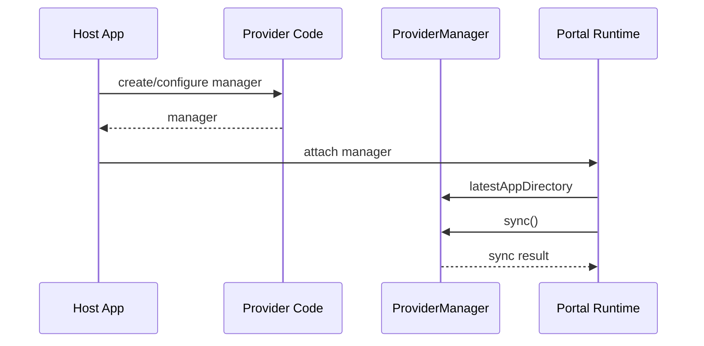
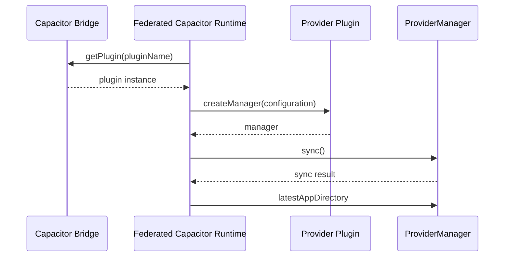

# Live Update Provider

[](https://github.com/ionic-team/live-update-provider-sdk/releases)
[](https://cocoapods.org/pods/LiveUpdateProvider)
[](https://central.sonatype.com/artifact/io.ionic/liveupdateprovider)

Live Update Provider is the shared iOS and Android contract that lets [Ionic Portals](https://ionic.io/docs/portals/) and [Federated Capacitor](https://ionic.io/docs/portals/for-capacitor/overview) load web assets from any external live update service, without depending on one specific backend.

## Overview

This project is centered around one main component: `ProviderManager`. A `ProviderManager` performs a sync for a single configured app instance and exposes the latest prepared app directory via `latestAppDirectory` for the host runtime to load. A provider implements the synchronization work behind it, including fetching, verifying, storing, and activating web assets.

There are two integration paths. Ionic Portals constructs and uses a `ProviderManager` directly. Federated Capacitor resolves a provider by its Capacitor plugin name and calls `createManager` on it directly, which returns a `ProviderManager`.

## Installation

### iOS

Swift Package Manager:

```swift
.package(
    url: "https://github.com/ionic-team/live-update-provider-sdk.git",
    from: "0.2.0"
)
```

```swift
.product(name: "LiveUpdateProvider", package: "live-update-provider-sdk")
```

CocoaPods:

```ruby
pod 'LiveUpdateProvider', '~> 0.2.0'
```

### Android

Gradle:

```kotlin
dependencies {
    implementation("io.ionic:liveupdateprovider:0.2.0")
}
```

## Usage

A provider implements `ProviderManager` and ships one of two ways, depending on the host: as a native iOS/Android library for Ionic Portals, or as a Capacitor plugin for Federated Capacitor.

### Implement a manager

#### iOS

```swift
import LiveUpdateProvider

final class ExampleManager: ProviderManager {
    private let appId: String
    private(set) var latestAppDirectory: URL?

    init(appId: String) {
        self.appId = appId
    }

    func sync() async throws -> (any ProviderSyncResult)? {
        latestAppDirectory = try prepareAssets()
        return nil
    }

    private func prepareAssets() throws -> URL {
        // Fetch, validate, store, and activate provider-managed assets.
        URL(fileURLWithPath: "/path/to/latest/app")
    }
}
```

#### Android

```kotlin
import io.ionic.liveupdateprovider.ProviderManager
import io.ionic.liveupdateprovider.ProviderSyncCallback
import java.io.File

class ExampleManager(private val appId: String) : ProviderManager {
    override var latestAppDirectory: File? = null
        private set

    override fun sync(callback: ProviderSyncCallback) {
        try {
            latestAppDirectory = prepareAssets()
            callback.onSuccess(null)
        } catch (error: Exception) {
            callback.onFailure(error)
        }
    }

    private fun prepareAssets(): File {
        // Fetch, validate, store, and activate provider-managed assets.
        return File("/path/to/latest/app")
    }
}
```

Kotlin callers can use the suspending `ProviderManager.sync()` extension instead of the callback API. Kotlin implementers can extend `CoroutineProviderManager` and implement `performSync` as a plain suspend function instead of the callback:

```kotlin
import io.ionic.liveupdateprovider.CoroutineProviderManager
import io.ionic.liveupdateprovider.ProviderSyncResult
import java.io.File

class ExampleManager(private val appId: String) : CoroutineProviderManager() {
    override var latestAppDirectory: File? = null
        private set

    override suspend fun performSync(): ProviderSyncResult? {
        latestAppDirectory = prepareAssets()
        return null
    }

    private suspend fun prepareAssets(): File {
        // Fetch, validate, store, and activate provider-managed assets.
        return File("/path/to/latest/app")
    }
}
```

### Ionic Portals

A Portals integration uses the manager directly — no provider type is involved. In your native app, construct your `ProviderManager` and attach it to the Portal's configuration. Portals reads `latestAppDirectory` to locate the web assets and calls `sync` to refresh them.

### Federated Capacitor

Federated Capacitor resolves providers by their Capacitor plugin name — conform your plugin class to `LiveUpdateProvider` directly. A web app installs the plugin and, for each app, selects a provider by name and passes its configuration.

See the [Federated Capacitor documentation](https://ionic.io/docs/portals/for-capacitor/live-updates) for more.

#### iOS

```swift
import Capacitor
import LiveUpdateProvider

@objc(ExamplePlugin)
final class ExamplePlugin: CAPPlugin, LiveUpdateProvider {
    func createManager(configuration: [String: Any]) throws -> any ProviderManager {
        guard let appId = configuration["appId"] as? String else {
            throw ProviderError.invalidConfiguration(message: "Missing appId.")
        }
        return ExampleManager(appId: appId)
    }
}
```

#### Android

```kotlin
import android.content.Context
import com.getcapacitor.Plugin
import com.getcapacitor.annotation.CapacitorPlugin
import io.ionic.liveupdateprovider.LiveUpdateProvider
import io.ionic.liveupdateprovider.ProviderError
import io.ionic.liveupdateprovider.ProviderManager

@CapacitorPlugin(name = "example")
class ExamplePlugin : Plugin(), LiveUpdateProvider {
    override fun createManager(context: Context, configuration: Map<String, Any>): ProviderManager {
        val appId = configuration["appId"] as? String
            ?: throw ProviderError.InvalidConfiguration("Missing appId.")
        return ExampleManager(appId)
    }
}
```

See the [Capacitor documentation](https://capacitorjs.com/docs/plugins/creating-plugins) for building and publishing a plugin.

## Data Flow

The host runtime integration differs by product, but both paths end with a `ProviderManager` that syncs assets and exposes `latestAppDirectory`.

### Ionic Portals



### Federated Capacitor



## Provider Responsibilities

- Keep `latestAppDirectory` pointed at the latest valid app directory. Do not point it at partial or invalid assets.
- Restore `latestAppDirectory` from persisted state when a manager is created so the host can load existing assets on launch.
- Own service-specific behavior such as authentication, artifact verification, cleanup, and rollback.

## Related Resources

- [Reference provider implementation](https://github.com/ionic-team/live-update-provider-mock)
- [Building a backend service](docs/live-update-service-architecture.md)

## License

Released under the MIT License. See [LICENSE](LICENSE).
