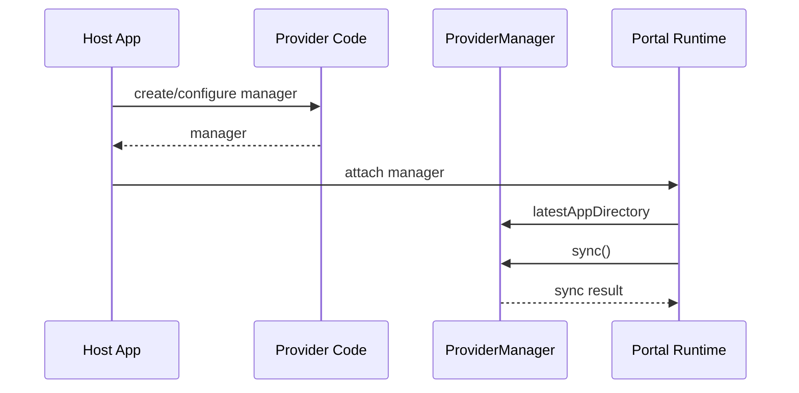
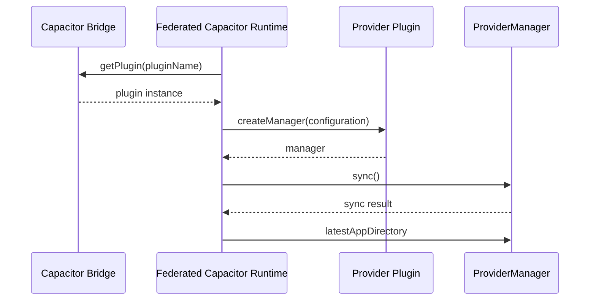

# Live Update Provider

[](https://github.com/ionic-team/live-update-provider-sdk/releases)
[](https://cocoapods.org/pods/LiveUpdateProvider)
[](https://central.sonatype.com/artifact/io.ionic/liveupdateprovider)

Live Update Provider is the shared iOS and Android contract that lets [Ionic Portals](https://ionic.io/docs/portals/) and [Federated Capacitor](https://ionic.io/docs/portals/for-capacitor/overview) load web assets from any external live update service, without depending on one specific backend.

## Overview

This project is centered around one main component: `ProviderManager`. A `ProviderManager` performs a sync for a single configured app instance and exposes the latest prepared app directory via `latestAppDirectory` for the host runtime to load. A provider implements the synchronization work behind it, including fetching, verifying, storing, and activating web assets.

There are two integration paths. Ionic Portals constructs and uses a `ProviderManager` directly. Federated Capacitor resolves a provider by its Capacitor plugin name and calls `createManager` on it directly, which returns a `ProviderManager`.

## Installation

### iOS

Swift Package Manager:

```swift
.package(
    url: "https://github.com/ionic-team/live-update-provider-sdk.git",
    from: "1.0.0"
)
```

```swift
.product(name: "LiveUpdateProvider", package: "live-update-provider-sdk")
```

CocoaPods:

```ruby
pod 'LiveUpdateProvider', '~> 1.0.0'
```

### Android

Gradle:

```kotlin
dependencies {
    implementation("io.ionic:liveupdateprovider:1.0.0")
}
```

## Usage

A provider implements `ProviderManager` and ships one of two ways, depending on the host: as a native iOS/Android library for Ionic Portals, or as a Capacitor plugin for Federated Capacitor.

### Implement a manager

#### iOS

```swift
import LiveUpdateProvider

final class ExampleManager: ProviderManager {
    private let appId: String
    private(set) var latestAppDirectory: URL?

    init(appId: String) {
        self.appId = appId
    }

    func sync() async throws -> (any ProviderSyncResult)? {
        latestAppDirectory = try prepareAssets()
        return nil
    }

    private func prepareAssets() throws -> URL {
        // Fetch, validate, store, and activate provider-managed assets.
        URL(fileURLWithPath: "/path/to/latest/app")
    }
}
```

#### Android

```kotlin
import io.ionic.liveupdateprovider.ProviderManager
import io.ionic.liveupdateprovider.ProviderSyncResult
import kotlinx.coroutines.Dispatchers
import kotlinx.coroutines.withContext
import java.io.File

class ExampleManager(private val appId: String) : ProviderManager {
    override var latestAppDirectory: File? = null
        private set

    override suspend fun sync(): ProviderSyncResult? = withContext(Dispatchers.IO) {
        latestAppDirectory = prepareAssets()
        null
    }

    private fun prepareAssets(): File {
        // Fetch, validate, store, and activate provider-managed assets.
        return File("/path/to/latest/app")
    }
}
```

#### Implementing from Java

`ProviderManager.sync()` is a Kotlin `suspend fun`, which Java cannot implement directly. If your provider is otherwise written in Java, add one small Kotlin class that implements `ProviderManager` and delegates to your existing Java code — the rest of your plugin, including whatever implements `LiveUpdateProvider`, can stay in Java. This SDK does not depend on `kotlinx-coroutines`, so add `org.jetbrains.kotlinx:kotlinx-coroutines-android` to your own project to use the APIs below.

If your Java code is callback-based, bridge it with `suspendCancellableCoroutine`:

```kotlin
import io.ionic.liveupdateprovider.ProviderManager
import io.ionic.liveupdateprovider.ProviderSyncResult
import java.io.File
import kotlin.coroutines.resumeWithException
import kotlinx.coroutines.resume
import kotlinx.coroutines.suspendCancellableCoroutine

class ExampleManager(private val javaManager: ExampleJavaManager) : ProviderManager {
    override val latestAppDirectory: File?
        get() = javaManager.latestAppDirectory

    override suspend fun sync(): ProviderSyncResult? = suspendCancellableCoroutine { continuation ->
        javaManager.sync(object : ExampleJavaManager.Callback {
            override fun onSuccess(result: ProviderSyncResult?) {
                continuation.resume(result)
            }

            override fun onFailure(error: Exception) {
                continuation.resumeWithException(error)
            }
        })
    }
}
```

If your Java code is blocking, wrap it with `withContext(Dispatchers.IO)` instead:

```kotlin
import io.ionic.liveupdateprovider.ProviderManager
import io.ionic.liveupdateprovider.ProviderSyncResult
import java.io.File
import kotlinx.coroutines.Dispatchers
import kotlinx.coroutines.withContext

class ExampleManager(private val javaManager: ExampleJavaManager) : ProviderManager {
    override val latestAppDirectory: File?
        get() = javaManager.latestAppDirectory

    override suspend fun sync(): ProviderSyncResult? = withContext(Dispatchers.IO) {
        javaManager.syncBlocking()
    }
}
```

### Ionic Portals

A Portals integration uses the manager directly — no provider type is involved. In your native app, construct your `ProviderManager` and attach it to the Portal's configuration. Portals reads `latestAppDirectory` to locate the web assets and calls `sync` to refresh them.

### Federated Capacitor

Federated Capacitor resolves providers by their Capacitor plugin name: iOS's `jsName`, Android's `@CapacitorPlugin(name = ...)`. Conform your plugin class to `LiveUpdateProvider` directly and keep that value identical on both platforms. A web app installs the plugin and, for each app, selects a provider by name and passes its configuration. 

If your plugin ships standalone to consumers who never use live updates, see [Optional dependency on Android](#optional-dependency-on-android) below for a way to avoid a hard dependency on this SDK.

Return a `MetadataSyncResult` from `sync()` when a provider needs to pass data back to the web layer after a sync. Federated Capacitor forwards `metadata` to JavaScript, so values must be bridge-safe (JSON-serializable).

See the [Federated Capacitor documentation](https://ionic.io/docs/portals/for-capacitor/live-updates) for more.

#### iOS

```swift
import Capacitor
import LiveUpdateProvider

@objc(ExamplePlugin)
final class ExamplePlugin: CAPPlugin, CAPBridgedPlugin, LiveUpdateProvider {
    public let identifier = "ExamplePlugin"
    public let jsName = "Example"
    public let pluginMethods: [CAPPluginMethod] = [
        CAPPluginMethod(name: "createManager", returnType: CAPPluginReturnPromise)
    ]

    func createManager(configuration: [String: Any]) throws -> any ProviderManager {
        guard let appId = configuration["appId"] as? String else {
            throw ProviderError.invalidConfiguration(message: "Missing appId.")
        }
        return ExampleManager(appId: appId)
    }
}
```

#### Android

```kotlin
import android.content.Context
import com.getcapacitor.Plugin
import com.getcapacitor.annotation.CapacitorPlugin
import io.ionic.liveupdateprovider.LiveUpdateProvider
import io.ionic.liveupdateprovider.ProviderError
import io.ionic.liveupdateprovider.ProviderManager

@CapacitorPlugin(name = "Example")
class ExamplePlugin : Plugin(), LiveUpdateProvider {
    override fun createManager(context: Context, configuration: Map<String, Any>): ProviderManager {
        val appId = configuration["appId"] as? String
            ?: throw ProviderError.InvalidConfiguration("Missing appId.")
        return ExampleManager(appId)
    }
}
```

##### Optional dependency on Android

Conforming to `LiveUpdateProvider` directly is the simplest option, and costs nothing extra for plugins that are only ever installed alongside Federated Capacitor or Portals. If your plugin also ships standalone to consumers who never use live updates, conformance forces all of them to carry Live Update Provider as a hard runtime dependency: Android resolves a class's declared interfaces eagerly when the class loads, so a plugin class implementing `LiveUpdateProvider` requires the SDK to be present the moment Capacitor instantiates it — whether or not `createManager` is ever called.

To keep the dependency optional, skip the `LiveUpdateProvider` conformance and expose a method with the identical signature instead:

```kotlin
@CapacitorPlugin(name = "Example")
class ExamplePlugin : Plugin() {
    fun createManager(context: Context, configuration: Map<String, Any>): ProviderManager {
        val appId = configuration["appId"] as? String
            ?: throw ProviderError.InvalidConfiguration("Missing appId.")
        return ExampleManager(appId)
    }
}
```

```kotlin
dependencies {
    compileOnly("io.ionic:liveupdateprovider:1.0.0")
}
```

Federated Capacitor resolves a plugin by first attempting to cast it to `LiveUpdateProvider`; if that fails, it falls back to resolving `createManager` reflectively and invoking it.

See the [Capacitor documentation](https://capacitorjs.com/docs/plugins/creating-plugins) for building and publishing a plugin.

## Data Flow

The host runtime integration differs by product, but both paths end with a `ProviderManager` that syncs assets and exposes `latestAppDirectory`.

### Ionic Portals



### Federated Capacitor



## Provider Responsibilities

- Keep `latestAppDirectory` pointed at the latest valid app directory. Do not point it at partial or invalid assets.
- Restore `latestAppDirectory` from persisted state when a manager is created so the host can load existing assets on launch.
- Own service-specific behavior such as authentication, artifact verification, cleanup, and rollback.

## Related Resources

- [Reference provider implementation](https://github.com/ionic-team/live-update-provider-mock)
- [Building a backend service](docs/live-update-service-architecture.md)

## License

Released under the MIT License. See [LICENSE](LICENSE).
